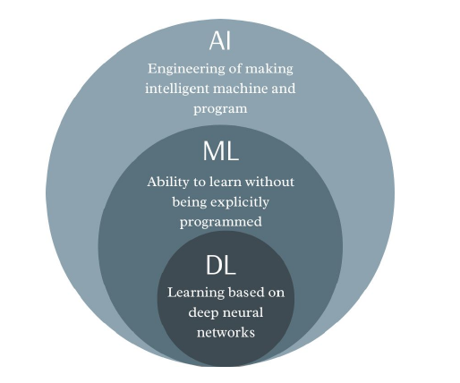

#### **Artificial Intelligence (AI) Overview**

- **Evolution**: AI has gained immense attention due to advancements in big data and computing power. It’s seen as transformative in nearly every industry.
- **Definitions**:
    - AI refers to creating systems that perform tasks that would require intelligence if performed by humans. #tech_definitions
    - **Key AI Approaches**:
        - Systems that think/act like humans.
        - Systems that think/act rationally.
    - **The law of Thought approach** - These law of thought approach were supposed to govern the operation of mind; their study initiated the field called logic.
    - **The Rational Agent approach** - is one that acts so as to achieve the best outcome or, when there is uncertainty, the best expected outcome

- CAPTCHA - **C**ompletely **A**utomated **P**ublic **T**uring test to tell **C**omputers and **H**umans **A**part #tech_fullforms
#### **AI Foundations**

1. **Mathematics**:
    - Boolean logic and computation theories.
    - Intractability and NP-completeness.
2. **Neuroscience**: Understanding brain functions to mimic computational models.
3. **Control Theory**: Feedback systems, learning, and adapting behavior.
4. **Linguistics**: Speech and language processing demonstrate core aspects of human intelligence.

#### **AI History**

- **Birth of AI (1943-1956)**: Neural networks, chess programs.
- **Early Enthusiasm (1952-1969)**: General Problem Solvers, Lisp.
- **Knowledge-Based Systems (1969-1979)**: MYCIN, DENDRAL.
- **Industry Growth (1980s)**: Rise of expert systems (e.g., R1).
- **Return of Neural Networks (1986- )**: Revival of backpropagation.
- **Current Trends**: Distributed AI, machine learning, deep learning.

#### **AI Techniques**

- **Rule-based systems**, **Fuzzy logic**, **Neural networks**, **Genetic algorithms**, **Deep learning**, and **Machine learning**.

#### **AI Categories**

- **Weak AI**: Simulated thinking, lacks consciousness.
- **Strong AI**: True thinking with conscious understanding.
- **Narrow AI**: Task-specific.
- **General AI**: Capable of a wide range of tasks.
- **Superintelligence**: Theoretical AI surpassing human intelligence.

#### **Key AI Applications**

- **Business**: Financial strategies, advice systems.
- **Engineering**: Design validation.
- **Healthcare**: Monitoring, diagnosis, and prescription.
- **Education**: AI-driven teaching tools.
- **Manufacturing and Agriculture**: AI-assisted inspection and harvesting.

#### **Machine Learning (ML) Overview**

- **Key Concepts**:
    - **Hypothesis & Target Class**: Creating models to match desired outcomes.
    - **Bias-Variance Tradeoff**: Balancing model accuracy and generalization.
    - **Dimensionality**: Addressing high-dimensional data issues.
- **Methods**:
    - **Regression**: Linear, multiple variables, gradient descent, regularization.
    - **Classification**: Decision trees, SVMs, Neural networks.
    - **Unsupervised Learning**: Clustering, mixture models, cluster validation.

#### **Data-Centric AI**

- **Focus on Data**: Engineering the data is as crucial as the models themselves. This new approach shifts focus from just programming to organizing and optimizing data.