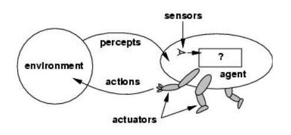

#### **Agents**

- **Definition**: An agent perceives its environment through sensors and acts upon that environment using actuators.
    - **Human agent**: Sensors (eyes, ears), actuators (hands, legs).
    - **Robotic agent**: Sensors (cameras, range finders), actuators (motors).

#### **Agent and Environment**

- **Agent function**: Maps percept histories to actions (f: P* → A).
- **Agent components**: Architecture + program.

#### **Rational Agents**

- A rational agent selects actions that maximize its performance measure based on percept sequences and built-in knowledge.
    - **Performance measure**: Criterion for evaluating the success of an agent’s actions.
    - **Rationality**: Not perfection, but the maximization of expected performance.

#### **PEAS (Performance measure, Environment, Actuators, Sensors) Framework**

- Example applications:
    - **Automated taxi driver**: Performance (safety, speed), Environment (roads, traffic), Actuators (steering, brakes), Sensors (cameras, GPS).
    - **Medical diagnosis system**: Performance (patient health), Environment (hospital), Actuators (screen display), Sensors (keyboard).

#### **Types of Environments**

- **Fully observable vs. Partially observable**: Whether the agent can access the complete state of the environment.
- **Deterministic vs. Stochastic**: Whether the environment’s next state is completely determined by its current state. (**Stratigic** if the environment is deterministic except for actions of other agents)
- **Episodic vs. Sequential**: Whether actions depend only on the current episode or the entire history.
- **Static vs. Dynamic**: Whether the environment changes during agent deliberation.
- **Discrete vs. Continuous**: Whether percepts and actions are distinct or continuous.
- **Single agent vs. Multiagent**: Whether the agent operates alone or interacts with other agents.

#### **Agent Types**

1. **Simple Reflex Agents**: Select actions based on the current percept, ignoring history.
2. **Model-Based Reflex Agents**: Keep track of the world’s state and use models to inform actions.
3. **Goal-Based Agents**: Choose actions that achieve specific goals.
4. **Utility-Based Agents**: Consider both goals and preferences (utility) when choosing actions.

#### **Learning Agents**

- Composed of:
    1. **Learning element**: Improves the agent’s performance based on experience.
    2. **Performance element**: Selects actions based on external feedback.
    3. **Critic**: Provides feedback to the learning element on the agent’s performance.
    4. **Problem Generator**: Suggests actions that lead to new experiences and learning opportunities.