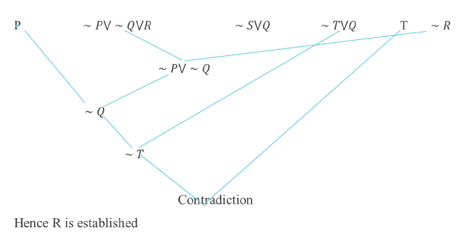

### **1. Introduction to Knowledge Representation (KR)** #must_read_full_notes

- **KR Assumption**: AI assumes knowledge can be represented as symbol structures (e.g., objects, facts, rules).
- **Example**:
    - `color(car1, red)` means "my car is red."
- **KR Language**: Special languages (not general ones like C++/Java) are designed for precise knowledge representation, reasoning, and manipulation.

### **2. Representation Adequacy**

- **Challenge**: Represent complex information such as time, beliefs, and uncertainty formally.
- **Well-defined Syntax and Semantics**:
    - Syntax dictates legal expressions.
    - Semantics defines the real-world meaning of expressions.

### **3. Inferential Adequacy and Efficiency**

- **Inferential Adequacy**: Ability to draw new conclusions from existing knowledge (e.g., “If it’s raining, John stays indoors”).
- **Efficiency**: Complex deductions may be computationally expensive; balance is necessary between complexity and efficiency.

### **4. Logic as a KR Language**

- **Logic**: Formal language with well-defined syntax and semantics. Examples include propositional, predicate, and temporal logic.
- **Example of Inference**:
    - **F1**: If hot and humid, it will rain.
    - **F2**: If humid, it’s hot.
    - **F3**: It’s humid now.
    - **Conclusion**: It will rain.

### **5. Propositional Logic**

- **Atoms**: Basic, non-decomposable declarative statements that are either true or false.
- **Truth Table for Propositions**:
    - Logical operators: negation (~), conjunction (∧), disjunction (∨), implication (→), and biconditional (↔).
- **Inference Rules**:
    - **Modus Ponen**: From "If P, then Q" and "P," infer "Q."
    - **Chain Rule**: If multiple conditions lead to a conclusion, infer that conclusion.

### **6. Predicate Logic**

- **Components**:
    - **Constants**: Specific values (e.g., numbers, names).
    - **Variables**: General placeholders.
    - **Functions**: Map variables/constants to values (e.g., `father(kamal)`).
    - **Predicates**: Map variables/constants to true or false (e.g., `likes(john, apples)`).
- **Terms and Atoms**: A term is either a constant or variable. Atoms are n-place predicate symbols combined with terms (e.g., `P(x, y)`).

### **7. Well-formed Formulas (WFF)**

- **Definition**: A syntactically correct expression in logic (e.g., axioms of natural numbers).

### **8. Skolemization and Prenex Normal Form**

- **Skolemization**: Removing existential quantifiers by introducing Skolem functions, essential for transforming formulas.
- **Prenex Normal Form**: Logical formulas with all quantifiers moved to the front, simplifying inferencing.

### **9. Inferencing in Predicate Logic**

- **Quantifiers**:
    - **Universal Quantifier (∀)**: Applies to all objects.
    - **Existential Quantifier (∃)**: Applies to at least one object.
- **Mixing Quantifiers**: Complex inferencing involving both universal and existential quantifiers (e.g., "Some patients like all doctors").

### **10. Semantic Networks and Frames**

- **Semantic Networks**: Graph-like structure with nodes representing objects and edges representing relationships (e.g., "Nellie is an elephant, elephants have trunks").
- **Frames**: Group facts about objects in slots (similar to classes in OOP). They allow inheritance (e.g., "Elephant has a trunk").
- **Example**:
    - **Nellie**: Instance of an elephant that likes apples.

### **11. Rule-Based Systems**

- **Rules**: Declarative if-then statements used for action-based systems (e.g., "If hot and smoky, then there’s fire").
- **Forward Chaining**: Starts with facts and applies rules to reach conclusions.
- **Backward Chaining**: Starts with a hypothesis and works backwards through rules to validate the hypothesis (similar to Prolog).

### **12. Expert Systems**

- **Applications**: Used in domains like medical diagnosis (e.g., MYCIN for bacterial infections).
- **Reasoning**: Involves backward chaining and use of certainty factors to assess the likelihood of different conclusions.