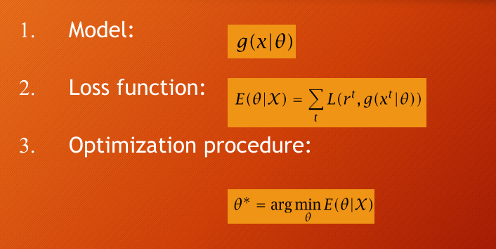

- **Learning a Class from Examples:**
    
    - Supervised learning involves learning a class (e.g., family car) from examples.
    - Input attributes (e.g., price, engine power) are used to make predictions.
    - The goal is to find a description that distinguishes between positive and negative examples.
- **Hypothesis and Generalization:**
    
    - A **hypothesis class** represents all possible hypotheses for classifying data.
    - The **Version Space** is the set of hypotheses consistent with the training data.
    - The objective is to select the hypothesis that generalizes best to unseen data.
- **VC Dimension:**
    
    - The Vapnik-Chervonenkis (VC) dimension measures the capacity of a hypothesis class to fit data.
    - A hypothesis class with a higher VC dimension can shatter more points (i.e., fit any possible labeling of those points).
- **Probably Approximately Correct (PAC) Learning:**
    
    - PAC learning aims to provide guarantees on how many examples are needed to achieve a desired accuracy with high probability.
    - The number of training examples required depends on the desired accuracy (ε) and confidence (δ).(4/ε log(4/δ)) 
- **Noise and Model Complexity:**
    
    - Noise introduces complications in learning and can make zero error infeasible.
    - Complex models can perfectly fit noisy data but may overfit (learning both the signal and noise).
    - Simpler models often generalize better (Occam's razor: prefer the simplest hypothesis that fits the data).
- **Overfitting and Underfitting:**
    
    - **Overfitting** occurs when the model is too complex and fits not only the underlying function but also the noise in the data.
    - **Underfitting** occurs when the model is too simple to capture the underlying patterns in the data.
- **Model Selection and Generalization:**
    
    - Model selection involves choosing the right balance between complexity and generalization.
    - A model should have just enough complexity to capture the underlying function without overfitting.
- **Triple Trade-Off:**
    
    - There is a trade-off between hypothesis complexity, training set size, and generalization error.
    - As the complexity of the hypothesis increases, generalization error decreases initially but then increases due to overfitting.
- **Cross-Validation:**
    
    - Used to estimate the generalization error.
    - Typically involves splitting data into training, validation, and test sets.
- **Supervised Learner Dimensions:**
    
    - **Model**: The hypothesis or function class.
    - **Loss Function**: Measures how well the model performs.
    - **Optimization Procedure**: Used to minimize the loss function.
    