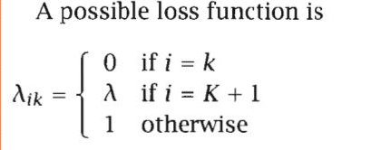

- **Overview:**
    
    - Bayesian Decision Theory provides a framework for making decisions under uncertainty.
    - In classification tasks, Bayes' rule is used to calculate class probabilities.
    - The goal is to make rational decisions to minimize expected risk, and Bayesian networks are introduced to represent dependencies among random variables.
- **Probability and Inference:**
    
    - Coin toss example: Uses Bernoulli distribution to estimate the probability of an event based on data (e.g., Heads or Tails).
    - **Estimation**: Probability estimation is based on the frequency of observed events.
    - **Prediction**: The next event is predicted using the estimated probabilities.
- **Bayes’ Rule in Classification:**
    
    - Used for classification tasks like credit scoring (e.g., categorizing customers as high-risk or low-risk).
    - **Posterior Probability**: In classification, Bayes’ rule calculates the posterior probability of each class based on the input features (e.g., income, savings).
    - For **K classes**, the classifier chooses the class with the highest posterior probability to minimize error.
    
- **Losses and Risks:**
    
    - Not all decisions carry the same cost; decisions in certain domains, like finance or medicine, have varying risks.
    - For example, in financial institutions, the cost of rejecting a high-risk applicant differs from the cost of approving a low-risk applicant.
    
    - Above is the risk for taking action ai assigned to class Ci when it actually belonged to class Ck and the loss is denoted by λik
    - **0/1 Loss**: This loss function aims to minimize risk by selecting the class with the highest probability.
    
    
- **Discriminant Functions:**
    
    - Used to divide feature space into decision regions based on class boundaries.
    
    - **Dichotomizer (K=2)**: When there are two classes, a single discriminant function can be used to classify data points.
    
- **Utility Theory:**
    
    - Utility theory is used to make decisions that maximize utility rather than minimizing risk alone.
    - Decisions are guided by the expected utility of outcomes.
    
- **Association Rules:**
    
    - Association rules are used to discover relationships between events (e.g., X → Y).
    - These rules do not imply causality, only association (e.g., people who buy item X also tend to buy item Y).
  