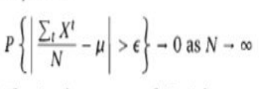

1. **Random Experiment**:
    
    - A process where the outcome cannot be predicted with certainty.
    - Examples include tossing a coin or rolling a die.
2. **Sample Space (S)**:
    
    - The set of all possible outcomes of a random experiment.
    - **Discrete sample space**: If the outcomes are countable (finite or countably infinite).
    - **Continuous sample space**: If the outcomes form a continuous range.
3. **Events**:
    
    - Subsets of the sample space.
    - Events can be manipulated using set operations like complement, intersection, and union.
4. Important formulae:
	- Bayes' Rule
	 
	 - Covariance and correlation
	 - Weak law of large numbers
	 
	 - Bernoulli Distribution
	 
	 - Binomial Distribution
	 
	 - Uniform Distribution
	 
	 - Normal Distribution
	 
	 
	 - Chi Square Distribution
	 
	 - T Distribution
	 
	 - F Distribution
	 