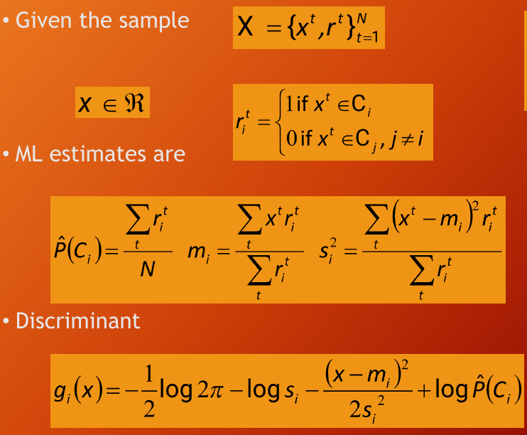
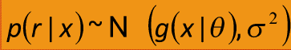

- **Maximum Likelihood Estimation (MLE)**:
    
    - MLE is used to estimate the parameters (θ) that maximize the likelihood function based on the observed data (X).
    - **Log Likelihood**: Used to simplify calculations of likelihood, especially for complex distributions.
    
    
- **Examples**:
    
    - **Bernoulli Distribution**: Involves binary outcomes (0,1) like success/failure.
    - **Multinomial Distribution**: Used when there are more than two outcomes.
    - **Gaussian Distribution**: Continuous data is often modeled using a normal distribution with parameters like mean (μ) and variance (σ²).
- **Bias and Variance**:
    
    - Bias refers to the error introduced when estimating a parameter.
    - Variance measures how much the estimate fluctuates with different datasets.
    - **Mean Square Error**: A combination of bias and variance (MSE = Bias² + Variance).
- **Bayesian Estimation**:
    
    - **Prior Distribution (p(θ))**: Represents initial beliefs about the parameter before observing data.
    - **Posterior Distribution (p(θ|X))**: Updated beliefs after observing the data.
    
    - **Maximum a Posteriori (MAP)**: Estimates the parameter by maximizing the posterior distribution.
    - **Bayesian Estimator**: Combines prior and data using Bayes’ rule to estimate parameters.
    
    - In the above equation if N increases the estimate tends to sample mean
      If  N decreases or σ decreases the estimate tends to μ
	
- **Regression** : 
	- 
	- 
- **Linear Regression** :
	- 
- **Error Measures** :
	- 
- **Bias-Variance Dilemma**:
    
    - Increasing model complexity decreases bias but increases variance.
    - The goal is to balance bias and variance to avoid both underfitting (high bias) and overfitting (high variance).
- **Model Selection**:
    
    - **Minimum Description Length (MDL)**: Selects the simplest model that still fits the data.
    - **Structural Risk Minimization (SRM)**: Balances complexity with minimizing risk to improve generalization.