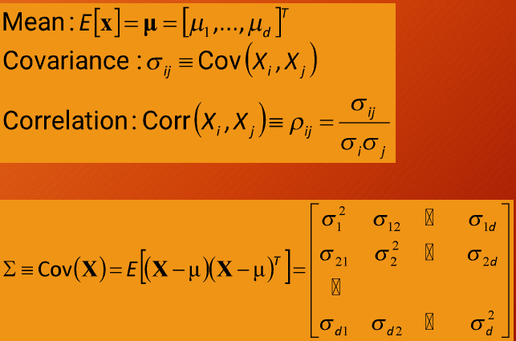
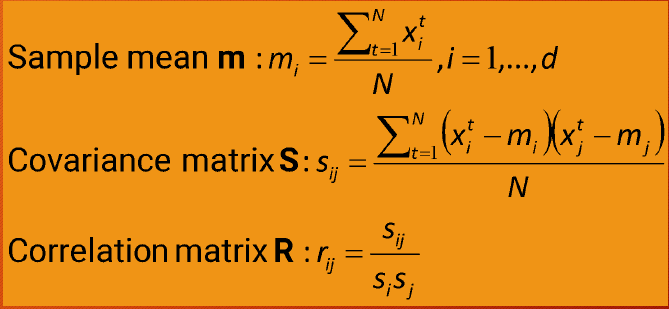
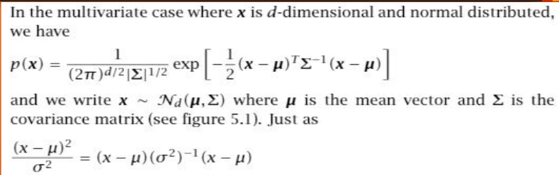
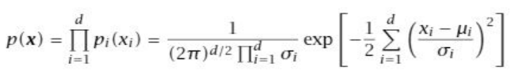
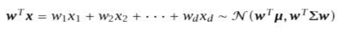
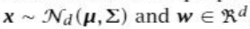
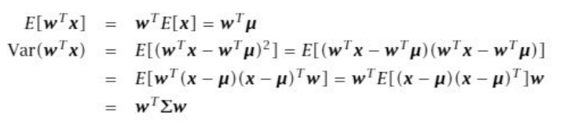
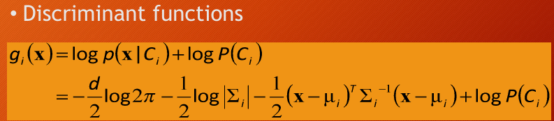

- **Multivariate Data**:
    
    - Deals with data that has multiple measurements or features.
    - **d-variate**: Data with d attributes or inputs.
    - **N instances**: The number of observations or examples.
- **Multivariate Parameters**:
	- 
	- 
- **Handling Missing Values**:
    
    - **Ignore instances**: Not ideal for small samples.
    - **Imputation**: Estimating missing values.
        - **Mean imputation**: Substitute the mean for numeric variables or the most frequent value for discrete variables.
        - **Regression imputation**: Predict missing values using known values of other variables.
- **Multivariate Normal Distribution**:
    
    - Extends the concept of a normal distribution to multiple variables.
    - **Mahalanobis Distance**: Measures distance between a point and the mean while accounting for variances and correlations.
    - 
- **Naive Bayes**:
    
    - Assumes independence between features. As the features are independent the joint probability comes out to be product of individual densities.
    - 
    - Simplifies calculations by assuming the covariance matrix is diagonal.
    - 
		
		
- **Parametric Classification**:
    
    - Uses discriminant functions to classify instances.
    - 
    - If class distributions follow a multivariate normal distribution, classification can be quadratic or linear depending on assumptions about the covariance matrix.
- **Covariance Matrix**:
    
    - **Shared vs. Different**: Depending on whether the covariance matrix is shared or different across classes, the complexity of the classifier changes.
    - **Diagonal Matrix**: Simplifies classification by assuming independent variables.
    - **Nearest Mean Classifier**: Classifies instances by their Euclidean distance to the nearest class mean (template matching).
- **Model Selection**:
    
    - More complex models (less restricted covariance matrices) reduce bias but increase variance.
    - Simpler models are preferred to control variance, with regularization used to maintain a balance.
- **Multivariate Regression**:
    
    - Extends linear regression to multiple variables.
    - Polynomial regression can be used by defining higher-order terms for better fitting.