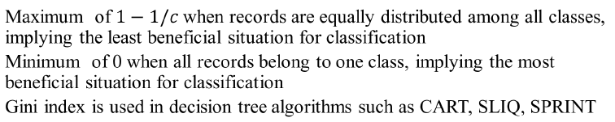

# Classification and Decision Trees

**Classification:**  
Classification is a supervised learning task where the goal is to assign predefined labels (classes) to data based on their features.

**Examples of Classification Tasks:**
- **Email categorization:** Spam or non-spam
- **Tumor identification:** Malignant or benign
- **Galaxy classification:** Elliptical, spiral, or irregular-shaped galaxies

---

## General Approach for Classification Models

1. **Training Phase:**
   - A model is trained on labeled data, where the attribute set `\mathbf{x}` is used to predict the class label `y`.
2. **Prediction Phase:**
   - The model is applied to unseen data to predict class labels.

---

## Classification Techniques

1. **Base Classifiers**  
   - Decision Trees  
   - Rule-based Methods  
   - Nearest-Neighbor  
   - Naïve Bayes  
   - Support Vector Machines (SVM)  
   - Neural Networks

2. **Ensemble Classifiers**  
   - Bagging  
   - Boosting  
   - Random Forests

---

## Decision Trees

Decision trees are a popular classification technique where data is split recursively based on attribute values. Each internal node represents a "test" on an attribute, and each leaf node represents a class label.

### Example of a Decision Tree:
For a simple dataset, the attributes could be:

- `\text{HomeOwner} \in \{Yes, No\}`
- `\text{MaritalStatus} \in \{Single, Married, Divorced\}`
- `\text{Income} \in \{< 80K, > 80K\}`

The decision tree splits the data based on these attributes to classify a target variable, such as whether a person will default on a loan.

---

## Decision Tre Induction

Decision tree algorithms include:

- **CART** (Classification and Regression Trees)
- **ID3**, **C4.5** (Developed by Ross Quinlan)
- **Hunt’s Algorithm**
- **SLIQ,SPRINT**

### Hunt’s Algorithm
At each node `t`, the following procedure is applied:
- If all records in `t` belong to the same class `y_t`, make it a leaf node.
- Otherwise, select an attribute to split the data and recursively apply the procedure.

---

## Splitting Criteria

To determine the "best" attribute for splitting, impurity measures are used.

### Gini Index

The Gini Index measures node impurity. For a node `t`, where `p_i` is the proportion of class `i` in node `t`, the Gini Index is defined as:

```math

\text{Gini}(t) = 1 - \sum_{i=1}^{c} p_i^2

```

For a binary classification problem, the Gini Index can be simplified to:

```math

\text{Gini}(t) = 2p(1 - p)

```


#### Example:
- For a node with class distribution `P(C1) = 0.5` and `P(C2) = 0.5`, the Gini Index is:
```math

\text{Gini} = 1 - (0.5^2 + 0.5^2) = 0.5

```

- For a pure node where `P(C1) = 1` and `P(C2) = 0`, the Gini Index is:
```math

\text{Gini} = 1 - (1^2 + 0^2) = 0

```

---

### Entropy

Entropy is another measure of impurity, given by:

```math

\text{Entropy}(t) = - \sum_{i=1}^{c} p_i \log_2(p_i)

```

#### Example:
- For a node with `P(C1) = 0.5` and `P(C2) = 0.5`, the entropy is:
```math

\text{Entropy} = - (0.5 \log_2(0.5) + 0.5 \log_2(0.5)) = 1

```

- For a pure node where `P(C1) = 1` and `P(C2) = 0`, the entropy is:
```math

\text{Entropy} = - (1 \log_2(1)) = 0

```

---

### Information Gain

Information Gain is used to select the attribute that best splits the data. It is calculated as the reduction in entropy after a split:

```math

\text{Gain}(A) = \text{Entropy}(\text{parent}) - \sum_{i=1}^{k} \frac{|D_i|}{|D|} \text{Entropy}(D_i)

```

where `D_i` is a partition of the data after the split.

---

### Misclassification Error

Misclassification Error is another impurity measure, defined as:

```math

\text{Error}(t) = 1 - \max(p_1, p_2, \dots, p_c)

```

---

## Handling Continuous Attributes

For continuous attributes like "income," decision trees often use binary splits of the form `A < v` or `A \geq v`, where `v` is a threshold value. To find the optimal split:

1. Sort the attribute values.
2. Evaluate potential splits based on Gini Index, Entropy, or other criteria.

---

## Advantages of Decision Trees

- Simple to understand and interpret.
- Fast classification of unknown records.
- Can handle both numerical and categorical data.
- Handles irrelevant and redundant attributes well.
- Robust to noise when proper pruning techniques are applied.

---

## Disadvantages of Decision Trees

- Greedy nature of decision tree algorithms may overlook interactions between attributes.
- Can overfit the data if not pruned properly.
- Decision boundaries are axis-parallel, meaning they may not work well for complex data structures.
