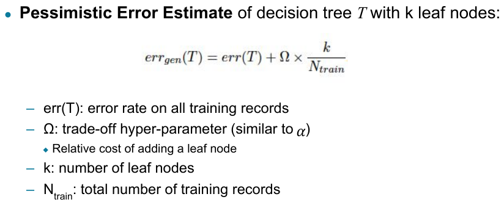

### Classification Errors
- **Training errors**: Errors made by the model on the training dataset.
- **Test errors**: Errors made by the model on the test dataset.
- **Generalization error**: Expected error over a random selection of data points from the same distribution.

---

## Underfitting and Overfitting

- **Underfitting** occurs when the model is too simple. Both training and test errors remain high.
- **Overfitting** occurs when the model is too complex. The training error decreases, but the test error increases due to the model fitting noise or irrelevant patterns in the training data.

---

### Example: Impact of Model Complexity

As the number of nodes in a decision tree increases:
- **Simple tree**: The model may underfit, as seen in a decision tree with only 4 nodes.
- **Complex tree**: The model may overfit, as in a decision tree with 50 nodes, where the model fits noise from the training data, leading to poor generalization.

---

## Reasons for Overfitting

1. **Insufficient training data**: The model may fit noise or irrelevant patterns due to a small dataset.
2. **High model complexity**: Complex models can introduce unnecessary components, increasing overfitting. This is exacerbated by the **Multiple Comparison Procedure** where irrelevant components are added when many options are available.

---

### Example of Overfitting with Noisy Attributes

Using irrelevant attributes (e.g., 100 noisy variables from a uniform distribution) alongside relevant features leads to a highly overfitted model, as it starts capturing noise rather than true patterns in the data.

---
## Effect of Multiple Comparison Procedure
-  Many algorithms employ the following greedy strategy:
– Initial model: $$
M
$$
– Alternative model: $$
M’ = M ∪ γ
$$
where γ is a component to be added to the model (e.g., a test condition of a decision tree)
– Keep M’ if improvement, $$
Δ(M,M’) > α
$$
- Often times, γ is chosen from a set of alternative components, $$
Γ = \{{γ_{1} , γ_{2} , …,
γ_{k} }\}
$$
- If many alternatives are available, one may inadvertently add irrelevant
components to the model, resulting in model overfitting
## Addressing Overfitting: Model Selection

### 1. **Validation Set Approach**
   - Divide the training data into two subsets: a **training set** for building the model and a **validation set** for estimating generalization error. This approach reduces the amount of data available for training but helps in model selection.

### 2. **Incorporating Model Complexity (Occam’s Razor)**
   - The principle of **Occam’s Razor** states that, given two models with similar generalization errors, the simpler model should be preferred. Complex models have a higher chance of overfitting.

#### General Error Formula:
$$
 \text{Gen. Error}(\text{Model}) = \text{Train. Error}(\text{Model, Train. Data}) + \lambda \times \text{Complexity}(\text{Model}) 
$$

---

## Pruning Decision Trees

1. **Pre-Pruning** (Early Stopping):
   - Stop tree growth early if:
     - All instances belong to the same class.
     - Attribute values for all instances are identical.
     - Class distribution does not improve with further splitting (e.g., using $\chi^2$ test or Gini index).

2. **Post-Pruning**:
   - Build the tree fully and then prune:
     - **Subtree Replacement**: Replace a subtree with a leaf node if the generalization error improves.
     - **Subtree Raising**: Replace a parent node with one of its subtrees if generalization error improves.

---

## Model Evaluation

1. **Holdout Method**: 
   - Reserve a portion of the dataset (e.g., $k\%$) for training and the rest for testing.

2. **Cross-Validation**:
   - Split the data into $k$ disjoint subsets. Train on $k-1$ subsets and test on the remaining subset. Repeat this $k$ times for each subset. Common values for $k$ include 5 and 10 (e.g., **k-fold cross-validation**).
3. **Leave-One-Out Cross-Validation (LOOCV)**:
   - A special case of cross-validation where $k = n$, where $n$ is the number of data points. The model is trained on all data except one point, and this is repeated for all points.

4. **Stratified Cross-Validation**:
   - Ensures that each fold has the same class distribution as the full dataset, which is especially useful for imbalanced data.

---