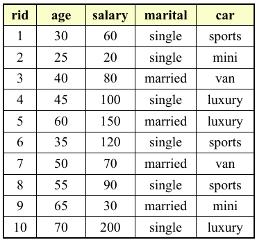
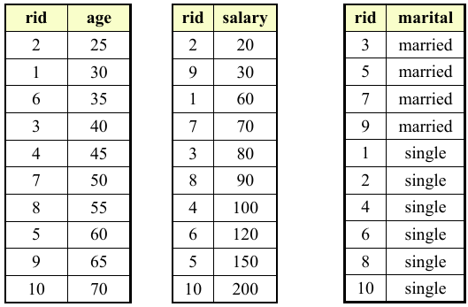
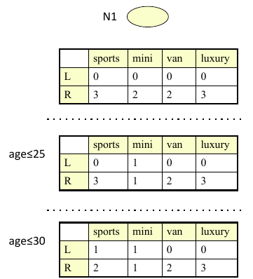
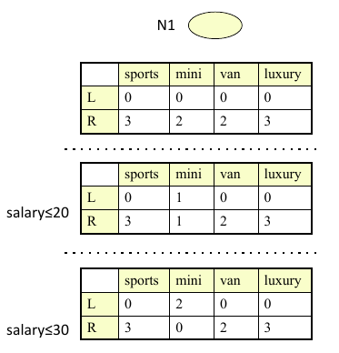
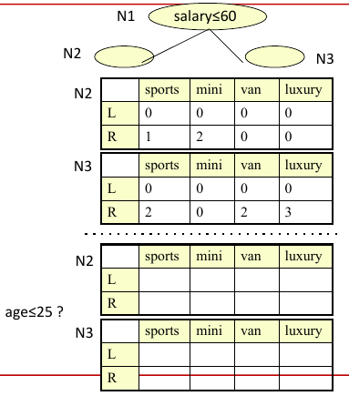

### Overview
SLIQ is a decision tree classifier designed for handling both numerical and categorical attributes. It uses a **pre-sorting** technique during the tree-growing phase, making it efficient for large disk-resident datasets. Instead of repeatedly sorting data at each node, SLIQ sorts the data once and uses **Breadth-First Search** (BFS) for tree construction.

---

## Key Issues in Tree Growth
1. **Split Point Selection**: Choosing the best points to split the data.
2. **Data Partitioning**: Dividing the data based on split points.

Most traditional decision tree algorithms use **depth-first search** and repeatedly sort the data at every node. SLIQ optimizes this by:
- Sorting the data once and storing it in **attribute lists**.
- Introducing a **class-list** data structure that stays memory-resident.

---

## Data Structures in SLIQ

1. **Attribute List**: Each attribute in the dataset is represented as a sorted list. Each entry contains:
   - Attribute value
   - Reference to the corresponding **class-list** entry

2. **Class List**: Each entry in the class list has:
   - Class label
   - Reference to the leaf node in the decision tree

The **class-list** remains in memory throughout the algorithm’s execution, and the **attribute lists** are projections of `(rid, attribute)` pairs.

---

### Example of Attribute List and Class List

The **attribute list** stores sorted data by attribute, and the **class list** holds references to the corresponding class labels and leaf nodes.

---

## Split Evaluation

SLIQ uses **GINI Index** or **Entropy** to evaluate potential splits. For each split:
- **L** values represent the distribution of records that satisfy the split condition.
- **R** values represent the distribution of records that do not satisfy the split condition.

The goal is to maximize the purity of the resulting subsets by minimizing impurity (using GINI or Entropy).

---

## Class List Updates

After a split is performed, the class list is updated to reflect the new structure of the tree. This involves reassigning records to the correct leaf node after the split.

---

## Memory Bottleneck

A potential bottleneck of SLIQ is that the **class-list** must always reside in memory. Although modern systems have large memories, this can still be a limitation for extremely large datasets.

---
