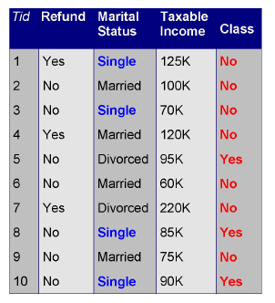
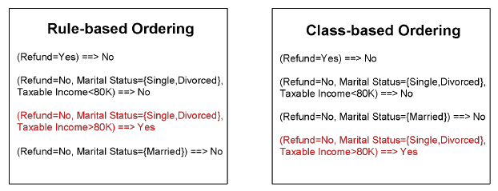
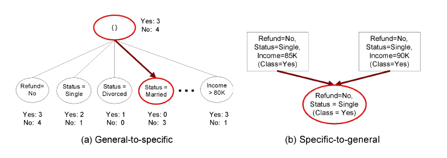
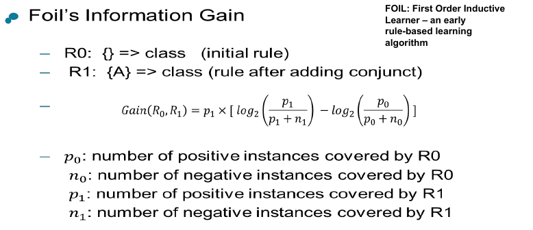
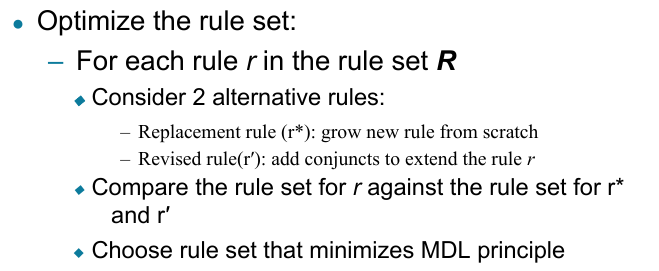

### Overview
A **rule-based classifier** classifies records using a collection of "if...then..." rules. Each rule is of the form:
- **Rule**: `(\text{Condition}) arrow y`
   - **Condition**: A conjunction of attribute tests.
   - **`y`**: The class label.

#### Example of Rules:
- `(\text{Give Birth} = \text{no}) \land (\text{Can Fly} = \text{yes}) arrow \text{Birds}`
- `(\text{Taxable Income} < 50K) \land (\text{Refund} = \text{Yes}) arrow \text{Evade} = \text{No}`

---

## Rule Characteristics

1. **Coverage**: The fraction of records that satisfy the condition of the rule.
   - Example: For the rule `(\text{Status} = \text{Single}) arrow \text{No}`, coverage could be `40\%`.
   
2. **Accuracy**: The fraction of records satisfying the condition that also satisfy the conclusion.
   - Example: Accuracy of `50\%` means half of the records meeting the condition also match the class label.

---

## Mutually Exclusive and Exhaustive Rules

1. **Mutually Exclusive Rules**:
   - Rules are independent, and each record is covered by at most one rule.

2. **Exhaustive Rules**:
   - The rule set accounts for all possible combinations of attribute values, meaning every record is covered by at least one rule.

---

## Handling Non-Mutually Exclusive or Non-Exhaustive Rules

1. If rules are **not mutually exclusive**:
   - A record may trigger multiple rules. This can be handled by:
     - **Ordered Rule Set**: Rank rules by priority and assign the class label of the highest-ranked rule.
     - **Unordered Rule Set**: Use a voting scheme.

2. If rules are **not exhaustive**:
   - A record may trigger no rules, in which case a **default class** is assigned.

---

## Rule Ordering Schemes

1. **Rule-based ordering**: Rules are ranked based on quality.
2. **Class-based ordering**: Rules with the same class labels are grouped together.


---

## Rule Construction Methods

1. **Direct Method**:
   - Rules are extracted directly from the data.
   - Examples: RIPPER, CN2, Holte’s 1R.
   
2. **Indirect Method**:
   - Rules are extracted from other classification models, such as decision trees.
   - Example: **C4.5rules**, which generates rules from a decision tree.

---
## Rule Growing



---
## Rule Evaluation


---
## RIPPER Algorithm (Direct Method)

For a two-class problem, one class is treated as positive, and the other as negative. RIPPER builds the rule set for the positive class first:
1. **Rule Growing**: Start with an empty rule and add conditions as long as they improve FOIL’s information gain.
2. **Pruning**: Remove unnecessary conditions using **incremental reduced error pruning**. The pruning criterion is:
   ```math
 v = (p - n / p + n) 
```
   where `p` is the number of positive examples and `n` is the number of negative examples covered by the rule.
- **Pruning method**: delete any final sequence of conditions that maximizes v


---

## Indirect Method: C4.5rules

This method extracts rules from an unpruned decision tree. For each rule `r: A arrow y`, alternative rules `r': A' arrow y` are considered, where `A'` removes one conjunct from `A`. The rule with the lowest pessimistic error is selected.

---

## Advantages of Rule-Based Classifiers

- Rule-based classifiers are expressive and easy to interpret, similar to decision trees.
- They perform well with imbalanced classes and can handle redundant or irrelevant attributes.
- However, they may struggle with variable interactions and missing values in the test set.

---
