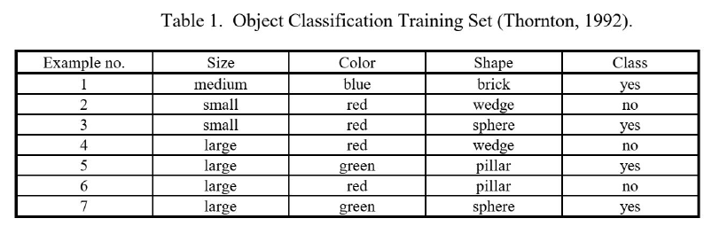
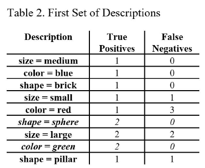
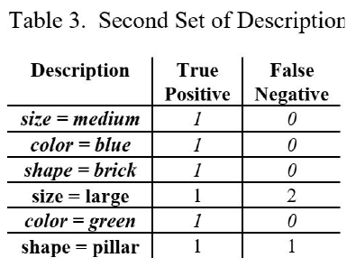
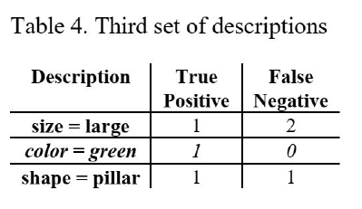
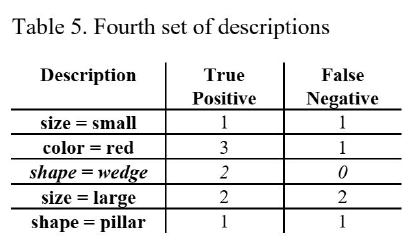
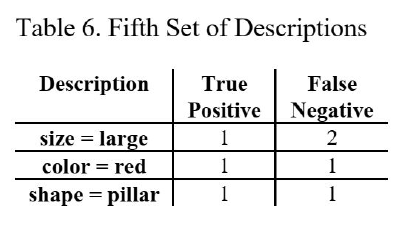
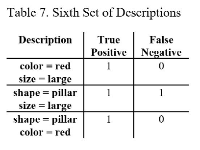

## Overview
Inductive Learning Algorithm (ILA) is a rule-based learning method that generates hypotheses in the form of rules by iteratively examining data. The goal is to create descriptions that capture patterns for classification.

## Hypothesis Generation
ILA starts by generating a **hypothesis** for the first class (e.g., "yes"). A **description** is formed, which is a conjunction of attribute-value pairs, representing the left-hand side of a rule.

For each description, the **true positives** and **false negatives** are identified, allowing the algorithm to determine the quality of the description.

### Example:

For descriptions 6 and 8, the true positives were maximized, and there were no false negatives, making them ideal candidates for rule generation.

## Rule Extraction and Classification
Once a rule is generated, the instances covered by this rule are marked as **classified**. These classified instances are no longer used in further hypothesis generation, streamlining the process.

### Example:

Instances 2 and 6 are classified after the rule extraction. These instances are then excluded from future hypothesis generation steps.

## Iteration Over Classes
The process is repeated, where the algorithm checks all the samples for the current class (e.g., "yes"). Once all instances of this class are classified, the algorithm moves on to the next class (e.g., "no").

### Example:
For the "no" class, the fourth set of descriptions extracted were insufficient in quality for rule generation. In such cases, the **description size** is increased by one to refine the results.

